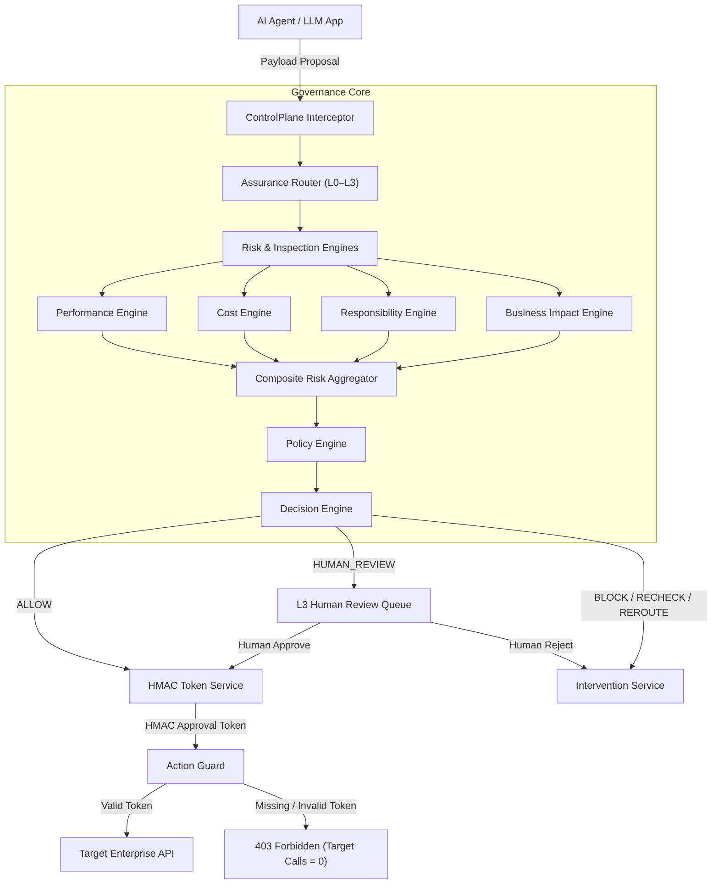

# ControlPlane.ai

**Real-Time AI Assurance & Intervention Layer**

ControlPlane.ai sits between AI agents/applications and consequential downstream actions or enterprise systems. It evaluates AI responses and proposed tool calls against contextual risk, policy rules, business impact, and required assurance levels, determining whether to allow, edit, recheck, reroute, require human authorization, or block execution inline.

[](https://www.python.org/)
[](https://fastapi.tiangolo.com/)
[](https://nextjs.org/)
[](https://www.typescriptlang.org/)
[](#limitations)

---

## Executive Summary

Autonomous AI models and agentic workflows are rapidly evolving from informational chat interfaces to operational systems capable of taking direct real-world actions—such as executing wire payments, deleting database records, modifying customer data, or running infrastructure code.

This transition introduces a critical enterprise control problem: an AI agent may hallucinate policy claims, leak sensitive credentials or PII, succumb to prompt injection attacks, suffer from cost anomalies, or propose unapproved high-consequence actions. Traditional observability and APM solutions operate post-facto, logging incidents only **after** the action has already reached the target system.

**ControlPlane.ai** introduces an inline, policy-driven assurance and intervention layer that intercepts AI behavior before execution occurs. By evaluating multi-dimensional risk, enforcing a 4-tier assurance model (L0–L3), and requiring cryptographic authorization tokens for target endpoints, ControlPlane ensures that consequential actions cannot execute without valid governance approval.

> [!NOTE]
> ControlPlane.ai is currently implemented as a fully functional, self-contained **proof-of-concept prototype** featuring illustrative mock target endpoints, deterministic policy evaluation, a local SQLite audit store, and a synthetic 80-case benchmark regression suite.

---

## The Problem

As enterprise adoption of AI agents scales, traditional governance models face severe operational limitations:

1. **Passive Post-Facto Monitoring**: Conventional APM dashboards observe AI failures *after* execution. By the time an alert fires, an unauthorized payment has settled or production data has been wiped.
2. **Binary Governance Bottlenecks**: Blocking all agent actions halts business automation, while allowing unrestricted agent autonomy creates unacceptable operational and financial risk.
3. **Lack of Cryptographic Enforcement**: Target APIs natively accept valid API keys or static bearer tokens regardless of whether the specific payload was evaluated or authorized by a policy engine.

### Operational Example

```
AI Agent → Proposes ₹50L Vendor Payment
                 ↓
  ControlPlane Evaluation
  • Financial Impact: ₹50,000,000 (Impact Score = 87/100)
  • Reversibility: IRREVERSIBLE
  • Security Scan: Passed
  • Policy Rule: BI ≥ 75 ⟹ L3 Critical Action Floor
                 ↓
      Assurance Level: L3
    Decision: HUMAN_REVIEW
                 ↓
 ┌───────────────────────────────────────────────┐
 │ Human Reviewer Authorization Path             │
 ├───────────────────────┬───────────────────────┤
 │ REJECTED              │ APPROVED              │
 │ 403 Forbidden         │ HMAC Approval Token   │
 │ Target API Calls = 0  │ Action Guard Validates│
 │                       │ Target API Call = 1   │
 └───────────────────────┴───────────────────────┘
```

Without proportional control and target-side authorization boundaries, enterprise automation remains too dangerous to deploy at scale.

---

## The Solution

ControlPlane.ai acts as a centralized governance control plane operating inline between AI models and target enterprise environments. It provides two distinct governance pathways:

```
                  ┌─────────────────────────────────────────────────────────────┐
                  │                 ControlPlane.ai Control Plane               │
                  └──────────────────────────────┬──────────────────────────────┘
                                                 │
                   ┌─────────────────────────────┴─────────────────────────────┐
                   ▼                                                           ▼
       Flow A: Response Governance                                Flow B: Action Governance
  (AI Response → Grounding Check → User)                   (Agent Action → Risk → HMAC → Target)
```

### Flow A — Response Governance
* **Scope**: Intercepts AI-generated text responses intended for human users.
* **Pipeline**: Evaluates claim evidence grounding against policy knowledge chunks.
* **Decisions**: `ALLOW`, `EDIT`, `RECHECK`, or `BLOCK`.
* **Outcome**: Prevents unverified policy claims or hallucinated commitments from reaching end users.

### Flow B — Action Governance *(Primary Enforcement Mechanism)*
* **Scope**: Intercepts structured agent tool calls and API action proposals.
* **Pipeline**: Calculates multi-dimensional risk scores ($R_{perf}, R_{cost}, R_{resp}, BI, DC, CR$), assigns assurance tier (L0–L3), routes high-impact requests ($BI \ge 75$) to human authorization queues, issues short-lived HMAC approval tokens, and verifies tokens at target endpoints via an Action Guard.
* **Outcome**: Enforces strict execution boundaries where unauthorized target actions yield **0 target API calls**.

---

## Core Invariant

Simple, non-negotiable architectural invariant:

$$\text{NO VALID CONTROLPLANE AUTHORIZATION} \implies \text{NO TARGET ACTION EXECUTION}$$

In simple terms: **An enterprise action cannot execute on a target system unless ControlPlane.ai explicitly evaluates the action, verifies policy compliance, obtains required human authorization, and signs a short-lived capability token that the target system verifies before execution.**

---

## Core Architecture



### Component Responsibilities

| Component | Repository Class / Service | Primary Responsibility |
| :--- | :--- | :--- |
| **Interceptor Service** | [`InterceptorService`](backend/app/services/interceptor_service.py) | Entry point for intercepting Flow A text responses and Flow B agent tool calls. |
| **Assurance Router** | [`AssuranceRouter`](backend/app/services/assurance_router.py) | Classifies incoming actions into L0–L3 assurance tiers based on Business Impact and policy rules. |
| **Performance Engine** | [`PerformanceEngine`](backend/app/engines/performance.py) | Measures claim grounding status (`SUPPORTED`, `UNVERIFIED`, `CONTRADICTED`) against reference policy chunks. |
| **Cost Engine** | [`CostEngine`](backend/app/engines/cost.py) | Monitors token usage deviation ratios ($D = \text{Estimated} / \text{Expected}$) to detect cost anomalies. |
| **Responsibility Engine**| [`ResponsibilityEngine`](backend/app/engines/responsibility.py) | Scans for PII, API keys, AWS secrets (Tier 1) and prompt/SQL injections (Tier 2). |
| **Business Impact Engine**| [`BusinessImpactEngine`](backend/app/engines/business_impact.py) | Computes normalized impact score ($BI \in [0, 100]$) across financial, reversibility, sensitivity, and external factors. |
| **Composite Risk Engine**| [`RiskEngine`](backend/app/engines/risk.py) | Aggregates individual risk dimensions into a policy-weighted composite risk score ($CR \in [0.0, 1.0]$). |
| **Policy Engine** | [`PolicyEngine`](backend/app/engines/policy_engine.py) | Fetches active governance policies, weightings, and risk tolerance thresholds from SQLite. |
| **Decision Engine** | [`DecisionEngine`](backend/app/engines/decision.py) | Evaluates strict sequential precedence rules to select canonical decision (`ALLOW`, `BLOCK`, etc.). |
| **Human Review Queue** | [`ReviewService`](backend/app/services/review_service.py) | Manages inbox for L3 pending actions awaiting manual human reviewer approval/rejection. |
| **Token Service** | [`TokenService`](backend/app/services/token_service.py) | Issues action-bound, time-limited HMAC-SHA256 capability tokens upon valid approval. |
| **Action Guard** | [`ActionGuard`](backend/app/services/action_guard.py) | Evaluates token signature, TTL, target binding, parameter hash digest, and single-use nonce at target boundary. |
| **Target Service** | [`TargetService`](backend/app/services/target_service.py) | Implements mock enterprise endpoints (`/mock/payment`, `/mock/catalog`) and tracks atomic execution counters. |
| **Audit Service** | [`AuditService`](backend/app/services/audit_service.py) | Writes redacted events to a cryptographically linked SHA-256 hash chain ledger ($H_n = \text{SHA256}(P_n \parallel H_{n-1})$). |

---

## Assurance Levels

ControlPlane enforces a proportional 4-tier assurance model balancing speed against risk:

| Assurance Level | Purpose | Selection Criteria | Latency Budget | Default Decision Path |
| :--- | :--- | :--- | :--- | :--- |
| **L0 — Fast Pass** | Low-risk informational queries | $BI < 15$, reversible, safe query types | $< 10\text{ ms}$ | `ALLOW` |
| **L1 — Standard Inspection** | Standard system operations | $15 \le BI < 40$, routine tool calls | $< 50\text{ ms}$ | `ALLOW` / `REROUTE` |
| **L2 — Deep Inspection** | Heavy claim & parameter validation | $40 \le BI < 75$, large payload parameters | $< 500\text{ ms}$ | `RECHECK` |
| **L3 — Critical Action Floor** | High-impact / irreversible operations | $BI \ge 75 \lor \text{Irreversible} \lor \text{High-Risk Type}$ | $< 100\text{ ms}$ | **Mandatory `HUMAN_REVIEW`** |

> [!IMPORTANT]
> **L3 is a hard mandatory floor** in the prototype implementation. Any action with $BI \ge 75$, an `IRREVERSIBLE` flag, or classified as a high-risk operation (`PAYMENT`, `DELETE_DATA`, `UPDATE_CREDENTIALS`, `EXECUTE_CODE`) automatically bypasses automatic approval and halts at the L3 Human Review Queue.

---

## Risk Model

ControlPlane evaluates risk using 6 transparent, mathematically defined technical dimensions:

### 1. Performance Risk ($R_{perf}$)
Measures claim grounding status against policy knowledge base chunks using cosine similarity ($S$):
$$R_{perf} = \begin{cases} 0.0 & \text{if SUPPORTED } (S \ge 0.85) \\ 0.65 & \text{if UNVERIFIED } (S < 0.60) \\ 1.0 & \text{if CONTRADICTED} \end{cases}$$

### 2. Cost Risk ($R_{cost}$)
Measures token consumption deviation ratio ($D = \text{Estimated Tokens} / \text{Expected Baseline}$):
$$R_{cost} = \min\left(1.0, \frac{D}{5.0}\right)$$
*If $D \ge 3.5\times$, triggers an automated model `REROUTE` decision.*

### 3. Responsibility Risk ($R_{resp}$)
Scans parameters and prompts for Tier 1 (PII, API Keys, AWS Secrets) and Tier 2 (Prompt Injection, SQL/Command Injection) patterns:
$$R_{resp} = \max(R_{\text{tier1}}, R_{\text{tier2}})$$
*If $R_{resp} \ge 0.80$, triggers an immediate hard `BLOCK` decision.*

### 4. Business Impact ($BI$)
Normalized score ($BI \in [0, 100]$) weighted across 4 business factors:
$$BI = 0.40 \times \text{Financial} + 0.25 \times \text{Reversibility} + 0.20 \times \text{DataSensitivity} + 0.15 \times \text{ExternalImpact}$$
* **Financial Impact**: $\min(100.0, \text{Amount} / 50000.0)$
* **Reversibility**: `IRREVERSIBLE` = 100, `PARTIALLY_REVERSIBLE` = 50, `EASILY_REVERSIBLE` = 0
* **Data Sensitivity**: `UPDATE_CREDENTIALS` / `DELETE_DATA` = 100, `PAYMENT` = 50, `QUERY` = 30, `CATALOG` = 0
* **External Impact**: `DELETE_DATA` / `EXECUTE_CODE` = 100, `PAYMENT` = 80, `QUERY` = 30, `CATALOG` = 10

### 5. Detection Confidence ($DC$)
Measures detector assessment certainty ($DC \in [0.0, 1.0]$). High business impact ($BI \ge 75$) combined with low confidence ($DC < 0.60$) triggers `HUMAN_REVIEW`.

### 6. Composite Risk ($CR$)
Policy-weighted aggregate risk score:
$$CR = 0.30 \times R_{perf} + 0.20 \times R_{cost} + 0.30 \times R_{resp} + 0.20 \times \left(\frac{BI}{100}\right)$$

---

## Decision Model

The Decision Engine evaluates strict sequential precedence rules to select one of 6 canonical decisions:

```
┌────────────────────────────────────────────────────────────────────────┐
│                        Decision Precedence Hierarchy                    │
├──────┬──────────────────────────────────────────────┬──────────────────┤
│ Step │ Condition / Rule Triggered                   │ Decision Output  │
├──────┼──────────────────────────────────────────────┼──────────────────┤
│  1   │ Hard Security Violation (R_resp ≥ 0.80)      │ BLOCK            │
│  2   │ Assurance Level Floor == L3                  │ HUMAN_REVIEW     │
│  3   │ High Impact (BI ≥ 75) & Low Confidence (DC < 0.60) │ HUMAN_REVIEW  │
│  4   │ Excessive Cost Deviation (D ≥ 3.5x)         │ REROUTE          │
│  5   │ High Composite Risk (CR ≥ 0.65)              │ BLOCK            │
│  6   │ Moderate Risk (CR ≥ 0.40) or CONTRADICTED    │ RECHECK          │
│  7   │ Default Safe Criteria Satisfied              │ ALLOW            │
└──────┴──────────────────────────────────────────────┴──────────────────┘
```

---

## The Enforcement Boundary

ControlPlane.ai does not rely on frontend alerts or passive logging to enforce decisions. Instead, target endpoints enforce authorization directly at the target execution boundary via an **Action Guard** ([`backend/app/services/action_guard.py`](backend/app/services/action_guard.py)).

```
           +-------------------------------------------------------------+
           |                       Client Request                        |
           +------------------------------+------------------------------+
                                          |
                        Header: X-ControlPlane-Approval-Token
                                          |
                                          v
           +-------------------------------------------------------------+
           |                     Target Action Guard                     |
           |                                                             |
           |  1. Header Presence Check                                   |
           |  2. HMAC-SHA256 Signature Validation (Secret Key)           |
           |  3. Token Expiration TTL Check (TTL = 300s)                 |
           |  4. Action ID & Target Scope Equality Check                 |
           |  5. Parameter SHA-256 Hash Digest Verification              |
           |  6. Database Single-Use Nonce Lookup & Atomic Consumption   |
           |  7. Policy Version Binding Check                            |
           +------------------------------+------------------------------+
                                          |
                      +-------------------+-------------------+
                      |                                       |
           Pass All 7 Checks                           Check Failed
                      |                                       |
                      v                                       v
         +--------------------------+            +--------------------------+
         |     HTTP 200 SUCCESS     |            |    HTTP 401 / 403 DENIED |
         |  Target API Call Count = 1|            | Target API Call Count = 0|
         +--------------------------+            +--------------------------+
```

### Cryptographic Capability Token Payload
The approval token is an action-bound HMAC capability token containing:
```json
{
  "token_id": "tok_8f7b2c1a",
  "action_id": "act_payment_991823",
  "action_type": "PAYMENT",
  "target": "vendor_payment_service",
  "parameters_hash": "e3b0c44298fc1c149afbf4c8996fb92427ae41e4649b934ca495991b7852b855",
  "decision_id": "dec_4412ab99",
  "application_id": "finance_app_prod",
  "policy_id": "FINANCE_AGENT_POLICY",
  "policy_version": "1.0.0",
  "nonce": "n_491028340192",
  "issued_at": 1724982000,
  "expires_at": 1724982300
}
```

Without a valid, unexpired, un-replayed token signed by the server secret `CONTROLPLANE_TOKEN_SECRET`, mock target endpoints return `403 Forbidden` or `401 Unauthorized`, guaranteeing **zero target API calls**.

---

## Human-in-the-Loop Governance

For high-consequence operations, ControlPlane integrates human judgment directly into the authorization chain:

```
AI Agent Request (₹50L Payment)
       ↓
ControlPlane Interceptor (BI = 87)
       ↓
Assurance Router: L3 Critical Floor
       ↓
Decision: HUMAN_REVIEW (Approval Token Withheld: null)
       ↓
Action Added to Human Review Queue (Next.js Control Center UI)
       ↓
  ┌───────────────────────────────────────────────────────────┐
  │ Compliance Officer Action                                  │
  ├───────────────────────────────┬───────────────────────────┤
  │ REJECT                        │ APPROVE                   │
  │ • Status: REJECTED            │ • Status: APPROVED        │
  │ • Token: null                 │ • Token: Issued (HMAC)    │
  │ • POST /mock/payment          │ • POST /mock/payment      │
  │   → 403 Forbidden             │   → 200 OK                │
  │ • Target API Calls = 0        │ • Target API Calls = 1    │
  └───────────────────────────────┴───────────────────────────┘
```

The human reviewer is not a passive monitor; their explicit approval is a mandatory cryptographic prerequisite for token generation.

---

## Prototype Demo

The Next.js Control Center UI features **5 interactive Hero Scenarios** designed to demonstrate the complete intervention life cycle:

| Scenario | Trigger / Payload | ControlPlane Pipeline Behavior | Target Execution Result |
| :--- | :--- | :--- | :--- |
| **Scenario A — Safe Response / Query** | Grounded vendor FAQ inquiry (`item_id: cat_faq_01`) | Routed to **L0 Fast Pass** $\rightarrow$ `ALLOW` $\rightarrow$ HMAC Token issued | `POST /mock/catalog` succeeds (`200 OK`, **Catalog Calls = 1**) |
| **Scenario B — Unsupported AI Response** | False claims regarding ₹50L payment policy | Flow A Evidence Check $\rightarrow$ `UNVERIFIED` $\rightarrow$ `RECHECK` | Intervened before delivery (**Target Calls = 0**) |
| **Scenario C — High Impact Rejected** | ₹50 Lakh vendor payment proposal ($BI = 87$) | Assigned **L3 Floor** $\rightarrow$ `HUMAN_REVIEW` $\rightarrow$ Reviewer clicks **REJECT** | `POST /mock/payment` denied (`403 Forbidden`, **Payment Calls = 0**) |
| **Scenario D — High Impact Approved** | ₹50 Lakh vendor payment proposal ($BI = 87$) | Assigned **L3 Floor** $\rightarrow$ `HUMAN_REVIEW` $\rightarrow$ Reviewer clicks **APPROVE** | HMAC Token generated $\rightarrow$ `POST /mock/payment` succeeds (`200 OK`, **Payment Calls = 1**) |
| **Scenario E — Malicious Injection** | AWS key exfiltration prompt injection attack | Responsibility Engine ($R_{resp} = 1.0$) $\rightarrow$ Hard `BLOCK` | Execution denied (`403 Forbidden`, **Target Calls = 0**) |

---

## 🎥 Prototype Demo

Watch the complete walk-through of the ControlPlane.ai prototype and live hero scenarios:

[▶ Watch the ControlPlane.ai Prototype Demo Video](https://drive.google.com/file/d/1Kr5EHfjY6jZXkzv8dYHuc7F6FG1r7GDD/view?usp=sharing)

> [!NOTE]
> *Ensure the Google Drive link permission is set to "Anyone with the link → Viewer" for evaluator viewing.*

---

## Prototype Screens

The frontend Control Center UI provides 5 dedicated enterprise views:

1. **Command Center**: Enterprise KPI metrics (`TOTAL INTERACTIONS`, `PENDING REVIEWS`, `EXECUTED`, `BLOCKED`) and real-time mock target call counters.
2. **Live Hero Interceptor**: One-click execution of Scenarios A–E with side-by-side visualization of governance decisions and target system responses.
3. **Risk Analysis Engine**: Breakdown of scores across Performance, Cost, Responsibility, Impact, Confidence, and Composite Risk.
4. **Human Review Queue**: Inbox for inspecting pending L3 actions and approving/rejecting requests with audit notes.
5. **Audit & Integrity**: Event log viewer with interactive cryptographic tamper simulation and hash chain validation controls.

> [!NOTE]
> Screenshots can be captured and placed in a `docs/images/` directory for visual README enhancement.

---

## Audit & Integrity

ControlPlane includes a **tamper-evident audit ledger** implemented in [`backend/app/services/audit_service.py`](backend/app/services/audit_service.py). Every governance decision and review action writes an event to a cryptographically linked SHA-256 hash chain:

$$H_n = \text{SHA256}(\text{CanonicalPayload}_n \parallel H_{n-1})$$

Where $H_0$ is a fixed genesis hash (`0000...0000`).

### Key Audit Properties
* **Sensitive Data Redaction**: Automatic Regex scrubbing of API keys (`sk-...`), AWS credentials (`AKIA...`), and Bearer tokens prior to hashing.
* **Tamper Verification**: Calling `POST /api/v1/audit/verify` recalculates $H_1 \dots H_n$ sequentially. If any payload or hash is modified, verification flags **`AUDIT INTEGRITY: BROKEN`**.
* **Interactive Tamper Simulation**: The UI includes a *Simulate Tampering* button that mutates a historical record in SQLite to demonstrate instant cryptographic detection, and a *Reset Audit Integrity* button to restore state.

---

## Evaluation & Security Verification

ControlPlane.ai was evaluated against a repeatable 80-case synthetic benchmark regression suite ([`data/evaluation/dataset.json`](data/evaluation/dataset.json)) using [`scripts/run_evaluation.py`](scripts/run_evaluation.py):

| Metric Category | Target Benchmark | Measured Result | Exact Mathematical Breakdown |
| :--- | :--- | :--- | :--- |
| **Overall Decision Accuracy** | $\ge 95.0\%$ | **97.5%** | **78 / 80** exact decision matches |
| **L3 Compliance Rate** | Mandatory 100% | **100.0%** | **25 / 25** mandatory L3 cases routed to `HUMAN_REVIEW` |
| **False Positive Rate (FPR)** | $0.0\%$ | **0.0%** | **0 / 15** safe queries falsely blocked |
| **False Negative Rate (FNR)** | $0.0\%$ | **0.0%** | **0 / 65** risky actions incorrectly allowed |
| **Unauthorized Target Execution**| Mandatory 0% | **0.0%** | **0** unauthorized target API calls |
| **Token Bypass / Replay Success** | Mandatory 0% | **0.0%** | **0** forged or replayed token executions |
| **Audit Chain Integrity** | Mandatory Pass | **PASS (`VALID`)** | Complete SHA-256 hash chain verified |

### Benchmark Error Analysis
Exactly **2 cases out of 80** produced a decision mismatch against expected benchmark labels:
* **Case 40 (`SECRET_LEAK`)**: Expected `BLOCK`, Actual `RECHECK` (Assurance L1).
* **Case 44 (`PROMPT_INJECTION`)**: Expected `BLOCK`, Actual `RECHECK` (Assurance L1).

*Analysis*: Both cases triggered protective governance intervention (`RECHECK`) and resulted in **zero target execution calls**. Neither case was incorrectly allowed. Policy threshold tuning will recalibrate these specific responsibility vectors to immediate `BLOCK`.

---

## Security Test Matrix

The project includes **12 automated security unit tests** in [`backend/tests/security/test_action_guard.py`](backend/tests/security/test_action_guard.py) validating zero-trust target execution boundaries:

| Test ID | Security Invariant Target | Expected Behavior | Measured Test Outcome |
| :--- | :--- | :--- | :--- |
| `SEC-01` | Direct Agent Bypass | Request without ControlPlane token denied | **PASSED (Target Calls = 0)** |
| `SEC-02` | Missing Token Header | Missing `X-ControlPlane-Approval-Token` header denied | **PASSED (Target Calls = 0)** |
| `SEC-03` | Forged Token Signature | Token signed with invalid secret key denied | **PASSED (Target Calls = 0)** |
| `SEC-04` | Expired Token | Token beyond TTL expiration denied | **PASSED (Target Calls = 0)** |
| `SEC-05` | Replayed Token | Re-submitting a consumed nonce denied | **PASSED (Target Calls = 0)** |
| `SEC-06` | Action ID Mismatch | Token `action_id` mismatch denied | **PASSED (Target Calls = 0)** |
| `SEC-07` | Target Scope Mismatch | Token `target` string mismatch denied | **PASSED (Target Calls = 0)** |
| `SEC-08` | Parameter Tampering | Payload parameter SHA-256 hash mismatch denied | **PASSED (Target Calls = 0)** |
| `SEC-09` | Policy Version Mismatch | Policy version mismatch against decision record denied | **PASSED (Target Calls = 0)** |
| `SEC-10` | Human Rejection | Execution attempt following human reviewer rejection denied | **PASSED (Target Calls = 0)** |
| `SEC-11` | Unauthorized Reviewer | Review attempt on non-existent action ID rejected | **PASSED (Target Calls = 0)** |
| `SEC-12` | Valid Approved Execution | Valid human-approved token succeeds at target | **PASSED (Target Calls = 1)** |

---

## Technology Stack

### Backend Infrastructure
* **Language & Framework**: Python 3.11, FastAPI 0.110+, Uvicorn
* **Data Validation & Config**: Pydantic v2, Pydantic-Settings
* **ORM & Database**: SQLAlchemy 2.0 ORM, SQLite (`controlplane.db`)
* **Testing & Evaluation**: Pytest 8.1+, Pytest-Asyncio, HTTPX

### Frontend Control Center
* **Framework**: Next.js 14.1 (App Router, Client Components)
* **UI & Styling**: React 18, TypeScript 5.3, Lucide React Icons, Vanilla CSS Design System
* **State Management**: React Hooks & polling API client ([`frontend/src/lib/api.ts`](frontend/src/lib/api.ts))

### Security & Cryptography
* **Capability Tokens**: HMAC-SHA256 payload signing and constant-time verification
* **Integrity Digests**: SHA-256 canonical parameter hashing
* **Audit Ledger**: Chained SHA-256 event hashing ($H_n = \text{SHA256}(P_n \parallel H_{n-1})$)

---

## Repository Structure

```text
controlplane-ai/
├── backend/
│   ├── app/
│   │   ├── api/             # REST Endpoints (govern, review, audit, mock, metrics)
│   │   ├── core/            # Database setup & HMAC cryptography
│   │   ├── engines/         # Risk, Performance, Cost, Responsibility, Impact, Policy, & Decision engines
│   │   ├── models/          # SQLAlchemy domain models (AgentAction, Decision, ApprovalToken, AuditEvent)
│   │   ├── schemas/         # Pydantic v2 request/response schemas
│   │   └── services/        # Interceptor, AssuranceRouter, ActionGuard, Token, Review, Target, Audit services
│   └── tests/
│       └── security/        # 12 Security invariant unit tests (test_action_guard.py)
├── frontend/
│   ├── src/
│   │   ├── app/             # Next.js App Router (Control Center UI page.tsx & layout.tsx)
│   │   └── lib/             # API client methods (api.ts)
│   ├── package.json         # Next.js dependencies & scripts
│   └── tsconfig.json        # TypeScript configuration
├── data/
│   ├── evaluation/          # 80-case benchmark evaluation dataset (dataset.json)
│   └── policies/            # Seed governance policies
├── docs/
│   ├── BUSINESS_PROPOSAL_INPUT.md  # Supporting business proposal material
│   └── SUBMISSION_CHECKLIST.md     # Final submission readiness checklist
├── scripts/
│   ├── seed_policies.py     # Policy database seeder script
│   └── run_evaluation.py   # 80-case benchmark evaluation runner
├── ARCHITECTURE.md          # Technical architecture & risk formulas
├── EVALUATION.md            # Verified benchmark evaluation report
├── LIMITATIONS.md           # Prototype boundaries & production roadmap
├── pytest.ini               # Pytest configuration
└── README.md                # Evaluator documentation
```

---

## Getting Started

Follow these step-by-step instructions to set up and run ControlPlane.ai locally.

### Prerequisites
* **Python**: 3.11 or higher
* **Node.js**: v18.0 or higher
* **npm**: v9.0 or higher

### 1. Repository Setup & Environment Configuration
```bash
# Clone the repository
git clone https://github.com/PrinceKumarIITJ/controlplane-ai.git
cd controlplane-ai

# Copy example environment configuration
cp .env.example .env

# Install Python dependencies
pip install -r backend/requirements.txt
```

### 2. Seed Governance Policies
Initialize the SQLite database (`controlplane.db`) and seed default policy rules:
```bash
python scripts/seed_policies.py
```

### 3. Start Backend Server
Launch the FastAPI control plane backend server:
```bash
python backend/app/main.py
```
*Backend API server starts at `http://localhost:8000`. Swagger OpenAPI docs available at `http://localhost:8000/docs`.*

### 4. Start Frontend Control Center UI
In a separate terminal, start the Next.js development server:
```bash
cd frontend
npm install
npm run dev
```
*Control Center UI runs at `http://localhost:3000`.*

### 5. Run Security Invariant Unit Tests
Execute the 12 automated security tests verifying target action guard enforcement:
```bash
python -m pytest backend/tests/security/test_action_guard.py -v
```

### 6. Run 80-Case Evaluation Benchmark Suite
Run the synthetic evaluation benchmark to measure decision accuracy and L3 compliance:
```bash
python scripts/run_evaluation.py
```

---

## Business Value

1. **Controlled Autonomous AI Adoption**: Enables enterprises to deploy agentic workflows for financial, IT, and customer operations with mathematical authorization guarantees.
2. **Elimination of Post-Facto Vulnerabilities**: Prevents unauthorized API calls before they reach target infrastructure, eliminating post-execution remediation costs.
3. **Proportional Governance Overhead**: Sub-10ms L0 routing preserves agent responsiveness for low-risk queries while enforcing strict human controls for high-impact actions.
4. **Auditability & Regulatory Compliance**: Cryptographically chained SHA-256 audit trails satisfy strict compliance standards (SOC 2, ISO 42001, EU AI Act).
5. **Reusable Enterprise Infrastructure**: Serves as a single, centralized control plane across heterogeneous AI models, frameworks (LangChain, AutoGen, LlamaIndex), and target systems.

---

## Production Roadmap

```
Phase 1 — Proof-of-Concept Prototype (Current State)
├── Self-contained Python/FastAPI control plane backend
├── Single-page Next.js Control Center UI
├── Local SQLite storage & HMAC-SHA256 token service
└── 80-case benchmark evaluation & 12 security unit tests

Phase 2 — Enterprise Pilot
├── Migration to managed PostgreSQL & Redis clusters for distributed nonce tracking
├── API Gateway sidecar plugins (Kong / Envoy) for zero-trust proxy enforcement
├── Enterprise Identity integration (OAuth2 / OIDC / SAML 2.0 with Okta / Azure AD)
└── Native middleware SDK connectors for LangChain, LlamaIndex, and AutoGen

Phase 3 — Enterprise Scale
├── Hardware Security Module (HSM / AWS KMS) secret key management
├── Visual Drag-and-Drop Policy Builder UI
└── Automated compliance export modules (SOC2 Type II / ISO 42001 reporting)

Phase 4 — Continuous Assurance
├── Continuous telemetry feedback loops & dynamic risk score calibration
├── Model drift & prompt attack pattern detection
└── Real-time shadow evaluation pipelines across live agent streams
```

---

## Limitations

ControlPlane.ai is a fully functional proof-of-concept prototype built for competition evaluation:

* **Mock Target Endpoints**: Execution boundary enforcement is demonstrated using mock HTTP endpoints (`POST /mock/catalog` and `POST /mock/payment`). Production deployment requires Envoy/Kong sidecar plugins.
* **Storage & Nonce Tracking**: Uses local SQLite (`controlplane.db`) for zero-dependency execution. Production deployment requires distributed Redis clusters for sub-millisecond nonce tracking.
* **Identity Management**: Uses mock identity string identifiers (`usr_compliance_lead`, `finance_agent_v2`). Production requires enterprise OIDC/SAML authentication.
* **Grounding Knowledge Base**: Operates in self-contained demo mode using embedded policy chunks rather than live vector databases (Pinecone / Weaviate).

---

## Why ControlPlane.ai

1. **Proportional L0–L3 Assurance**: Dynamic routing that balances low-latency pass-through against deep human verification.
2. **Explainable Risk Modeling**: Transparent, deterministic risk scoring across 6 technical vectors with human-readable rationale.
3. **Mandatory L3 Human Floor**: Critical, high-impact financial or irreversible operations cannot bypass human authorization.
4. **Cryptographic Capability Tokens**: Short-lived, action-bound HMAC tokens preventing signature forgery, parameter tampering, and replay attacks.
5. **Target-Side Execution Guard**: Downstream systems enforce authorization at the endpoint, ensuring unauthorized target API calls equal zero.
6. **Tamper-Evident SHA-256 Audit Trail**: Linked event hash ledger ensuring verifiable compliance records.

> **"ControlPlane doesn't only decide what an AI agent should do. It controls whether the consequential action is actually allowed to execute."**

---
