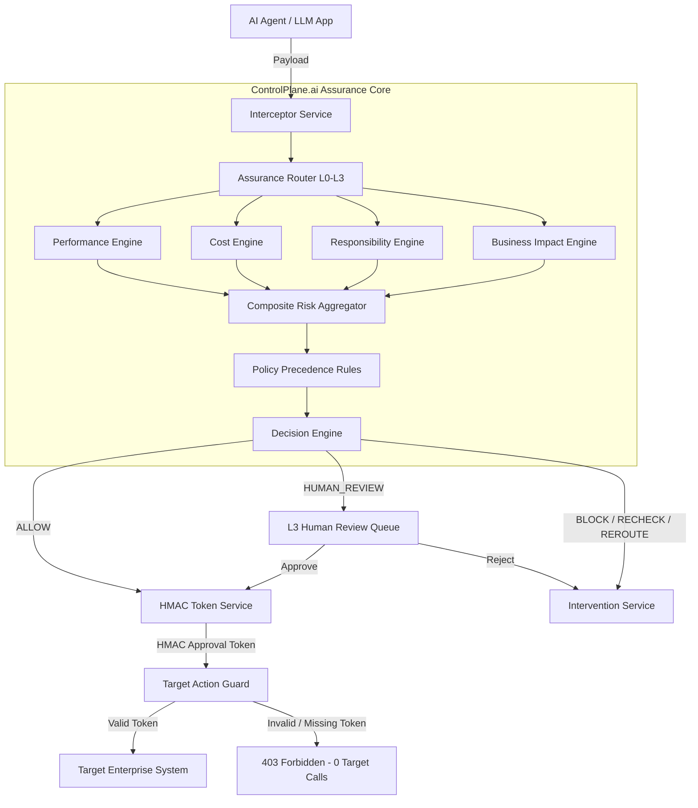

# ControlPlane.ai

ControlPlane.ai is a real-time AI assurance and intervention layer that evaluates AI responses and agent actions across performance, cost, responsibility and business impact, applies proportional governance, and prevents unauthorized high-impact AI actions from reaching target systems.

---

## 1. Problem

Autonomous AI agents and LLM-driven applications are transitioning from passive chat interfaces to active operational systems with direct system capabilities (e.g., executing financial transactions, modifying enterprise databases, triggering DevOps deployments, updating credentials).

This shift introduces critical enterprise risks:
* **Hallucinations & Misinformation**: AI models generate ungrounded policy promises or false claims without evidence context.
* **Sensitive Data Leaks**: Agents inadvertently expose PII, API keys, and corporate credentials.
* **Irresponsible & Malicious Actions**: Prompt injection attacks manipulate agent context to execute unauthorized system commands.
* **Cost Anomalies & Unbounded Loops**: Recursive agent prompting and infinite loops cause exponential token consumption and cloud overruns.
* **The Post-Facto Monitoring Gap**: Traditional APM tools and logging dashboards only observe failures **after** an AI agent has executed an action.

**ControlPlane.ai solves this by providing inline intervention before execution occurs.**

---

## 2. Solution

ControlPlane.ai introduces a closed-loop governance cycle:

$$\text{DETECT} \longrightarrow \text{ASSESS} \longrightarrow \text{DECIDE} \longrightarrow \text{INTERVENE} \longrightarrow \text{LEARN}$$

1. **DETECT**: Intercepts AI text responses and agent tool call proposals inline.
2. **ASSESS**: Computes explainable risk scores across Performance, Cost, Responsibility, Business Impact, and Detection Confidence.
3. **DECIDE**: Evaluates policy rules and enforces 4-tier assurance routing (L0–L3).
4. **INTERVENE**: Issues `ALLOW`, `EDIT`, `RECHECK`, `REROUTE`, `HUMAN_REVIEW`, or `BLOCK` decisions.
5. **LEARN**: Records cryptographically chained SHA-256 audit events for compliance auditing.

---

## 3. Core Architecture



---

## 4. Two Governance Flows

ControlPlane supports dual inline governance flows:

### Flow A — Response Governance (AI $\rightarrow$ ControlPlane $\rightarrow$ User)
* **Goal**: Validate AI text output against verified policy knowledge chunks before presentation to the user.
* **Pipeline**: `AI Response` $\rightarrow$ `ControlPlane Performance Engine` $\rightarrow$ `Evidence Grounding` $\rightarrow$ `Decision (ALLOW / RECHECK)` $\rightarrow$ `User`.

### Flow B — Action Governance (AI Agent $\rightarrow$ ControlPlane $\rightarrow$ Target System)
* **Goal**: Intercept agent tool calls and enforce target authorization boundaries.
* **Pipeline**: `Agent Action` $\rightarrow$ `Risk Inspection` $\rightarrow$ `Policy Rules` $\rightarrow$ `Human Review (if L3)` $\rightarrow$ `HMAC Approval Token` $\rightarrow$ `Action Guard` $\rightarrow$ `Target System`.

---

## 5. Key Technical Innovation

$$\text{NO VALID CONTROLPLANE AUTHORIZATION} \implies \text{NO TARGET ACTION EXECUTION}$$

ControlPlane.ai does not merely generate passive risk warnings or post-hoc log alerts. Target systems strictly enforce authorization at the execution boundary using short-lived **HMAC-SHA256 Approval Tokens** (`X-ControlPlane-Approval-Token`). Without a valid token signed by the server secret, target endpoints return `403 Forbidden` and **zero target API calls occur**.

---

## 6. Multi-Dimensional Risk Model

ControlPlane evaluates 6 explainable technical dimensions:

1. **Performance Risk ($R_{perf}$)**: Evaluates evidence grounding status (`SUPPORTED`, `UNVERIFIED`, `CONTRADICTED`) against knowledge base chunks.
2. **Cost Risk ($R_{cost}$)**: Calculates token usage deviation factor ($D = \text{Estimated} / \text{Expected}$). Triggers automated `REROUTE` at $3.5\times$.
3. **Responsibility Risk ($R_{resp}$)**: Scans for Tier 1 (PII, Secrets) & Tier 2 (Prompt Injection, SQL Injection) violations.
4. **Business Impact ($BI$)**: $BI = 0.40 \times \text{Financial} + 0.25 \times \text{Reversibility} + 0.20 \times \text{Sensitivity} + 0.15 \times \text{External}$.
5. **Detection Confidence ($DC$)**: Measures certainty of detector assessments.
6. **Composite Risk ($CR$)**: $CR = 0.30 R_{perf} + 0.20 R_{cost} + 0.30 R_{resp} + 0.20 (BI / 100)$.

---

## 7. 4-Tier Assurance Levels

* **L0 Fast Pass**: Sub-10ms evaluation for low-impact informational queries ($BI < 30$).
* **L1 Standard Inspection**: Active risk inspection for standard tool calls ($30 \le BI < 60$).
* **L2 Deep Inspection**: Heavy claim verification and evidence retrieval ($60 \le BI < 75$).
* **L3 Critical Action Floor**: Mandatory human-in-the-loop review floor for high-impact actions ($BI \ge 75 \lor \text{Irreversible}$). Token is strictly withheld until explicit human approval.

---

## 8. Hero Demonstrations

The Next.js Control Center features 5 interactive Hero Scenarios:

| Scenario | Input | Expected ControlPlane Behavior | Expected Target Outcome |
| :--- | :--- | :--- | :--- |
| **Scenario A — Safe Response / Query** | Grounded vendor FAQ inquiry | L0 Fast Pass $\rightarrow$ `ALLOW` $\rightarrow$ HMAC Token issued | Target call succeeds (`200 OK`, `CATALOG TARGET CALLS: 1`) |
| **Scenario B — Unsupported AI Claim** | False ₹50L payment approval claim | Flow A Grounding $\rightarrow$ `UNVERIFIED` $\rightarrow$ `RECHECK` | Intervened before user delivery (`TARGET CALLS: 0`) |
| **Scenario C — High Impact Rejected** | ₹50 Lakh vendor payment ($BI = 87$) | $BI \ge 75 \implies$ L3 Floor $\rightarrow$ `HUMAN_REVIEW` $\rightarrow$ Human REJECT | Direct target call blocked (`403 Forbidden`, `PAYMENT TARGET CALLS: 0`) |
| **Scenario D — High Impact Approved** | ₹50 Lakh vendor payment ($BI = 87$) | L3 Pending $\rightarrow$ Human APPROVE $\rightarrow$ HMAC Token issued | Target call succeeds (`200 OK`, `PAYMENT TARGET CALLS: 1`) |
| **Scenario E — Malicious Injection** | AWS secret exfiltration attempt | Responsibility Engine ($R_{resp} = 1.0$) $\rightarrow$ Immediate `BLOCK` | Execution denied (`TARGET CALLS: 0`) |

---

## 9. Security Proof & Invariant Test Suite

ControlPlane includes 12 automated security invariant tests (`backend/tests/security/test_action_guard.py`):

$$\text{Invalid Authorization} \implies \text{Target Calls} = 0 \quad | \quad \text{Valid Authorization} \implies \text{Target Calls} = 1$$

* `SEC-01` Direct Agent Bypass $\rightarrow$ **PASSED (Target Calls = 0)**
* `SEC-02` Missing Token Header $\rightarrow$ **PASSED (Target Calls = 0)**
* `SEC-03` Forged Token Signature $\rightarrow$ **PASSED (Target Calls = 0)**
* `SEC-04` Expired Token $\rightarrow$ **PASSED (Target Calls = 0)**
* `SEC-05` Replayed Token $\rightarrow$ **PASSED (Target Calls = 0)**
* `SEC-06` Action ID Mismatch $\rightarrow$ **PASSED (Target Calls = 0)**
* `SEC-07` Target Mismatch $\rightarrow$ **PASSED (Target Calls = 0)**
* `SEC-08` Parameter Tampering $\rightarrow$ **PASSED (Target Calls = 0)**
* `SEC-09` Policy Version Mismatch $\rightarrow$ **PASSED (Target Calls = 0)**
* `SEC-10` Human Rejection $\rightarrow$ **PASSED (Target Calls = 0)**
* `SEC-11` Unauthorized Reviewer $\rightarrow$ **PASSED (Target Calls = 0)**
* `SEC-12` Valid Approved Execution $\rightarrow$ **PASSED (Target Calls = 1)**

---

## 10. Benchmark Evaluation Results

Evaluated against a 80-case repeatable benchmark regression suite (`data/evaluation/dataset.json`):

* **Total Benchmark Cases**: 80
* **Overall Decision Accuracy**: **97.5%** (78 / 80 exact decision matches)
* **L3 Compliance Rate**: **100.0%** (25 / 25 mandatory L3 cases enforced)
* **False Positive Rate (FPR)**: **0.0%** (0 / 15 safe queries falsely blocked)
* **False Negative Rate (FNR)**: **0.0%** (0 / 65 risky actions allowed)
* **Unauthorized Target Execution**: **0%**
* **Token Bypass / Replay Success**: **0%**

*Classification Note*: Two cases (Case 40 `SECRET_LEAK` and Case 44 `PROMPT_INJECTION`) were assigned `RECHECK` instead of hard `BLOCK`. These were not counted as false negatives under our binary safety definition because neither risky case was incorrectly `ALLOWED`, and both resulted in zero target execution.

---

## 11. Technology Stack

* **Backend**: Python 3.11, FastAPI, Uvicorn, SQLAlchemy 2.0, PyTest.
* **Frontend**: Next.js 14.1 (App Router), React 18, TypeScript, Lucide Icons, Vanilla CSS.
* **Database**: SQLite (`controlplane.db`) with SHA-256 hash chain audit logging.
* **Security & Cryptography**: HMAC-SHA256 capability tokens, SHA-256 parameter digest verification, atomic single-use nonce tracking.

---

## 12. Project Structure

```text
controlplane-ai/
├── backend/
│   ├── app/
│   │   ├── api/             # REST Endpoints (govern, review, audit, mock, metrics)
│   │   ├── core/            # Database initialization & HMAC cryptography
│   │   ├── engines/         # Inspection engines (performance, cost, responsibility, impact, risk, decision)
│   │   ├── models/          # SQLAlchemy domain models
│   │   ├── schemas/         # Pydantic v2 schemas
│   │   └── services/        # Interceptor & DB services
│   └── tests/
│       └── security/        # 12 Security invariant unit tests
├── frontend/
│   ├── src/
│   │   ├── app/             # Next.js App Router (Control Center UI)
│   │   └── lib/             # API client methods
├── data/
│   └── evaluation/          # 80-case evaluation benchmark dataset
├── docs/
│   ├── BUSINESS_PROPOSAL_INPUT.md
│   └── SUBMISSION_CHECKLIST.md
├── scripts/
│   ├── seed_policies.py     # Policy database seeder
│   └── run_evaluation.py   # 80-case benchmark evaluation runner
├── ARCHITECTURE.md          # Technical architecture documentation
├── DEMO_GUIDE.md            # 3-minute hero demonstration script
├── EVALUATION.md            # Verified benchmark evaluation report
├── LIMITATIONS.md           # Prototype boundaries & roadmap
└── README.md                # Evaluator-facing documentation
```

---

## 13. Quick Start Guide

### Prerequisites
* Python 3.11+
* Node.js v18+

### 1. Configure Environment & Seed Policies
```bash
# Copy example environment file
cp .env.example .env

# Seed initial governance policies into database
python scripts/seed_policies.py
```

### 2. Start Backend Server
```bash
python backend/app/main.py
```
*Backend runs at `http://localhost:8000`.*

### 3. Start Frontend Control Center UI
```bash
cd frontend
npm install
npm run dev
```
*Frontend runs at `http://localhost:3000`.*

### 4. Run 80-Case Evaluation Benchmark
```bash
python scripts/run_evaluation.py
```

### 5. Run 12 Security Invariant Tests
```bash
python -m pytest backend/tests/security/test_action_guard.py -v
```

---

## 14. Documentation Index
* [ARCHITECTURE.md](file:///c:/Users/Prince%20Kumar/OneDrive/Documents/controlplane-ai/ARCHITECTURE.md): Full technical architecture and risk engine formulas.
* [EVALUATION.md](file:///c:/Users/Prince%20Kumar/OneDrive/Documents/controlplane-ai/EVALUATION.md): Verified 80-case benchmark metrics and mathematical formulas.
* [LIMITATIONS.md](file:///c:/Users/Prince%20Kumar/OneDrive/Documents/controlplane-ai/LIMITATIONS.md): Prototype boundaries and production integration roadmap.
* [BUSINESS_PROPOSAL_INPUT.md](file:///c:/Users/Prince%20Kumar/OneDrive/Documents/controlplane-ai/docs/BUSINESS_PROPOSAL_INPUT.md): Supporting material for executive business proposals.
* [SUBMISSION_CHECKLIST.md](file:///c:/Users/Prince%20Kumar/OneDrive/Documents/controlplane-ai/docs/SUBMISSION_CHECKLIST.md): Submission readiness checklist.


---

## 16. Prototype Limitations

ControlPlane.ai is a working proof-of-concept prototype.
* **Mock Targets**: Downstream targets `/mock/catalog` and `/mock/payment` demonstrate execution boundary enforcement. Production deployment requires API Gateway sidecar plugins (Kong/Envoy).
* **Database & Nonces**: Local SQLite storage is used for zero-dependency local evaluation. Production deployment requires PostgreSQL and Redis.
* **Provider Abstraction**: Demo Mode uses self-contained deterministic policy knowledge chunks. Real-time deployment connects to production vector databases (Pinecone/Weaviate).

---

## 17. Future Production Roadmap

1. **Distributed Gateway Sidecars**: Envoy / Kong API gateway plugins for zero-trust token enforcement.
2. **PostgreSQL & Redis Clusters**: Scalable persistence and sub-millisecond distributed nonce tracking.
3. **Enterprise Identity Integration**: OAuth2 / OIDC / SAML SSO with Attribute-Based Access Control (ABAC).
4. **LLM SDK Connectors**: Middleware integrations for LangChain, LlamaIndex, AutoGen, and CrewAI.
5. **Hardware Security Module (HSM)**: Vault and HSM secret management for server-side token signing keys.
